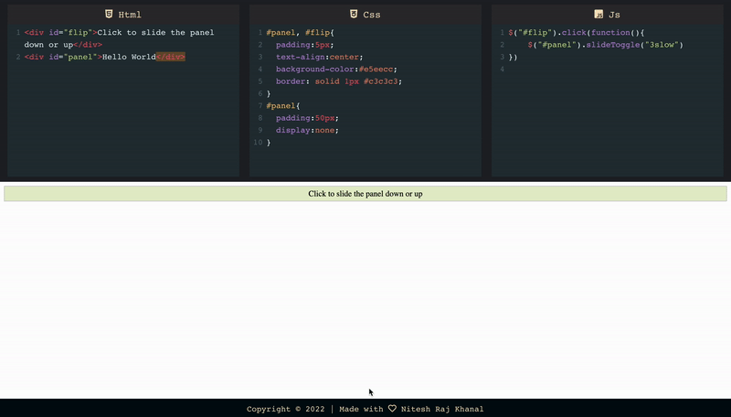

## Online code editor for HTML, CSS and Javascript to discover frontend code

  

### Features:

- No installation, work online and build web pages.
- Auto Save of all your work
- Supports JQuery
- Autoclose of tags and brackets
- Live Preview

### Show your support

Give a ⭐ if you like this website!
